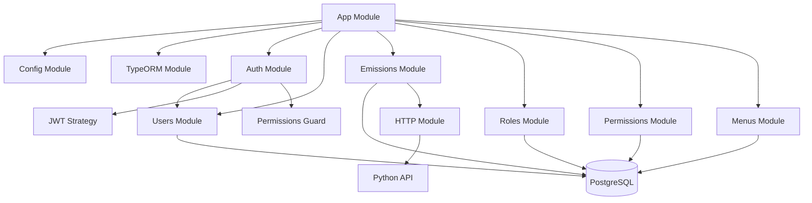

# 智能碳排放管理系统 - Node.js 后端服务

## 项目架构



## 核心模块说明

### 配置模块 (Config Module)
- 全局配置管理
- 环境变量验证
- 数据库连接配置

### 认证模块 (Auth Module)
- 用户登录认证
- JWT token 管理
- 权限验证守卫

### 用户模块 (Users Module)
- 用户管理（CRUD）
- 密码加密
- 角色关联

### 排放管理模块 (Emissions Module)
- 碳排放数据管理
- 与Python服务交互
- 数据预测功能

### 角色模块 (Roles Module)
- 角色管理
- 权限分配
- 菜单关联

### 权限模块 (Permissions Module)
- 权限定义
- 权限检查
- 访问控制

### 菜单模块 (Menus Module)
- 系统菜单管理
- 动态路由配置
- 权限关联

## 技术栈

- NestJS - 主框架
- TypeORM - ORM框架
- PostgreSQL - 数据库
- JWT - 认证
- Passport - 认证中间件
- Swagger - API文档

## 项目结构

```
src/
├── common/          # 公共工具和装饰器
├── config/          # 配置文件
├── database/        # 数据库配置
├── modules/         # 功能模块
│   ├── auth/       # 认证模块
│   ├── users/      # 用户模块
│   ├── emissions/  # 排放管理模块
│   ├── roles/      # 角色模块
│   ├── permissions/# 权限模块
│   └── menus/      # 菜单模块
├── app.module.ts   # 主模块
└── main.ts         # 应用入口
```